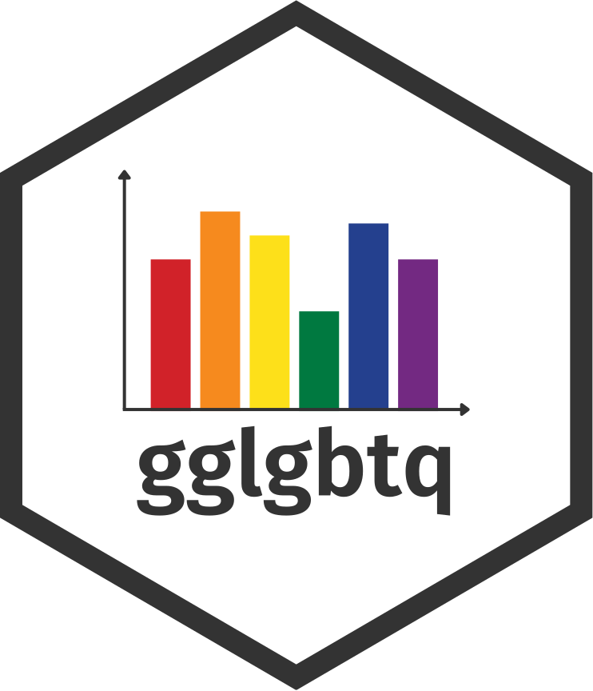

```{r opts, echo = FALSE}
knitr::opts_chunk$set(
  collapse = TRUE,
  fig.height = 1.6
)

library(gglgbtq)
options(gglgbtq_font_size = 1.7)
set.seed(7)
```

# gglgbtq <a href="https://turtletopia.github.io/gglgbtq/"></a>

<!-- badges: start -->
[](https://lifecycle.r-lib.org/articles/stages.html#experimental)
[](https://CRAN.R-project.org/package=gglgbtq)
[](https://github.com/turtletopia/gglgbtq/actions)
[](https://app.codecov.io/gh/turtletopia/gglgbtq?branch=master)
<!-- badges: end -->

gglgbtq provides multiple palettes based on flags in LGBTQ community. These palettes are accompanied by ggplot2 themes that maximize readability of each palette (especially of the white strip that is present in most flags).

## Installation

```{r install, eval = FALSE}
# Install the development version from GitHub:
# install.packages("devtools")
devtools::install_github("turtletopia/gglgbtq")
```

## User guide

To list all available palettes, call:

```{r pride_head}
show_pride()
```

The most common use case is to use palettes with ggplot2:

```{r ggplot2, fig.height=3}
library(ggplot2)

data <- data.frame(
  group = rep(c("yes", "no", "maybe"), each = 3) |>
    as.factor(),
  x = rep(seq_len(3), times = 3),
  y = runif(3 * 3) + .5
)

ggplot(data, aes(x = x, y = y, fill = group)) +
  geom_bar(stat = "identity", position = "dodge") +
  scale_fill_manual(values = palette_lgbtq("pansexual"))
```

Use matching `theme_lgbtq()` to make colors stand out the most:

```{r ggplot2_theme, fig.height=3}
ggplot(data, aes(x = x, y = y, fill = group)) +
  geom_bar(stat = "identity", position = "dodge") +
  scale_fill_manual(values = palette_lgbtq("pansexual")) +
  theme_lgbtq("pansexual")
```

`theme_lgbtq()` passes additional parameters to `ggplot2::theme()`, so it's fully customizable:

```{r ggplot2_theme_custom, fig.height=3}
ggplot(data, aes(x = x, y = y, fill = group)) +
  geom_bar(stat = "identity", position = "dodge") +
  scale_fill_manual(values = palette_lgbtq("pansexual")) +
  theme_lgbtq("pansexual", legend.position = "left")
```

Almost all ggplot2 uses of `palette_lgbtq()` will be with `color` and `fill` scales, so the `scale_color_lgbtq()` and `scale_fill_lgbtq()` functions provide a shorthand and more descriptive notation:

```{r ggplot2_scale, fig.height=3}
ggplot(data, aes(x = x, y = y, fill = group)) +
  geom_bar(stat = "identity", position = "dodge") +
  scale_fill_lgbtq("pansexual")
```

## Gallery

Only a few most common palettes are included below. For the complete list, see [palette gallery vignette](https://turtletopia.github.io/gglgbtq/articles/gallery.html).

```{r palettes}
palette_lgbtq("rainbow")
palette_lgbtq("philadelphia")
palette_lgbtq("progress")
palette_lgbtq("lesbian")
# In its original meaning of "gay men"
palette_lgbtq("gay")
palette_lgbtq("bisexual")
# Background added to avoid the "disappearance" of the white stripe
print(palette_lgbtq("transgender"), background = "gray92")
palette_lgbtq("asexual")
palette_lgbtq("nonbinary")
palette_lgbtq("intersex")
```

## End notes

I believe in equal rights and treatment for everybody, regardless of their sexuality, gender identity, skin tone, nationality, and other features beyond human control. Thus, I do not allow gglgbtq to be used in any project that promotes hate based on the aforementioned factors.
