# gglgbtq

<!-- badges: start -->

[](https://lifecycle.r-lib.org/articles/stages.html#experimental)
[](https://CRAN.R-project.org/package=gglgbtq)
[](https://github.com/turtletopia/gglgbtq/actions)
[](https://codecov.io/gh/turtletopia/gglgbtq?branch=master)
<!-- badges: end -->

## Installation

``` r
# Install the development version from GitHub:
# install.packages("devtools")
devtools::install_github("turtletopia/gglgbtq")
```

## Gallery

``` r
palette_lgbtq("rainbow")
```

<!-- -->

``` r
palette_lgbtq("philadelphia")
```

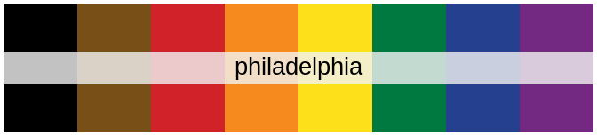<!-- -->

``` r
palette_lgbtq("progress")
```

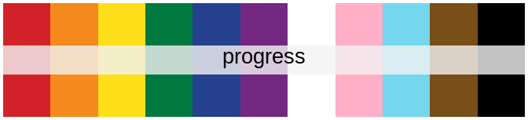<!-- -->

``` r
palette_lgbtq("lesbian")
```

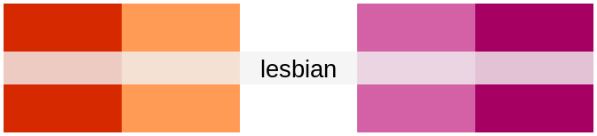<!-- -->

``` r
palette_lgbtq("gay_man")
```

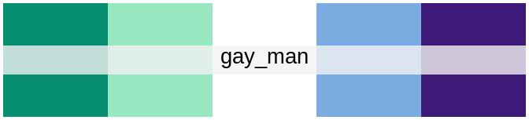<!-- -->

``` r
palette_lgbtq("bisexual")
```

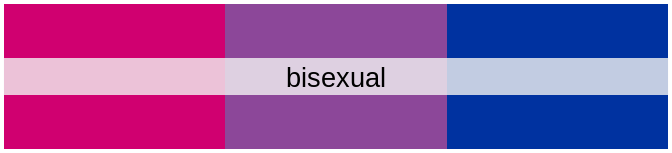<!-- -->

``` r
# Background added to avoid the "disappearance" of the white stripe
print(palette_lgbtq("transgender"), background = "gray92")
```

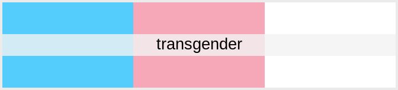<!-- -->

``` r
palette_lgbtq("asexual")
```

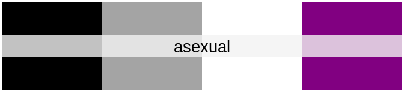<!-- -->

``` r
palette_lgbtq("pansexual")
```

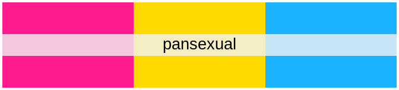<!-- -->

``` r
palette_lgbtq("nonbinary")
```

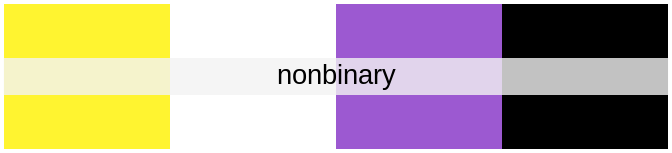<!-- -->

``` r
palette_lgbtq("intersex")
```

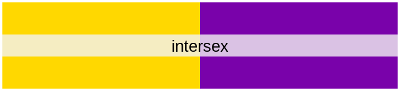<!-- -->

``` r
palette_lgbtq("aromantic")
```

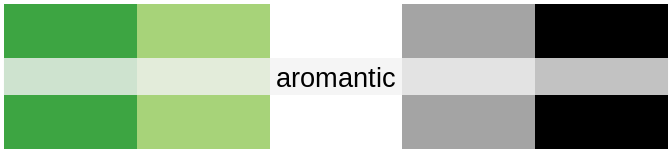<!-- -->

``` r
palette_lgbtq("genderfluid")
```

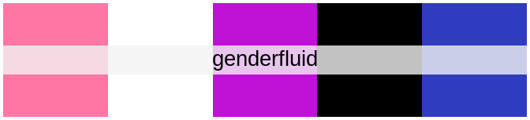<!-- -->

``` r
palette_lgbtq("genderqueer")
```

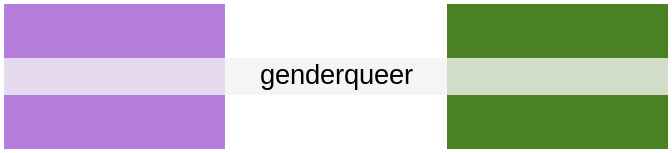<!-- -->

``` r
# Alternative version of 5-stripes lesbian flag
palette_lgbtq("lesbian_7")
```

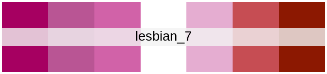<!-- -->

``` r
# Alternative version of 5-stripes gay men flag
palette_lgbtq("gay_man_7")
```

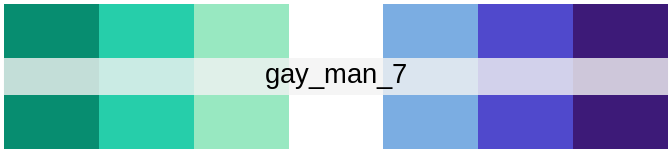<!-- -->

## End notes

I believe in equal rights and treatment for everybody, regardless of
their sexuality, gender identity, skin tone, nationality, and other
features beyond human control. Thus, I do not allow gglgbtq to be used
in any project that promotes hate based on the aforementioned factors.
